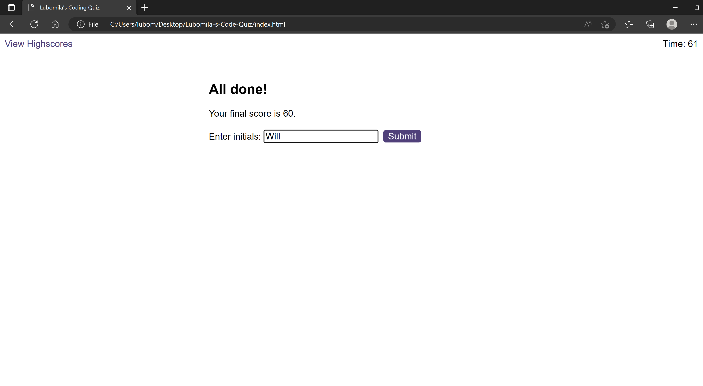

# Lubomila-s-Code-Quiz
Working with Web APIs

## Description

"Lubomila's Code Quiz" is a timed coding quiz with multiple-choice questions.This app runs in the browser, and it features HTML and CSS powered by JavaScript code that I write. The user interface is cleaned,polished and responsive. The quiz consists five questions and at the end of it, the user can find that all high scores are being stored. 

## Installation

Follow the link for the deployed website [Coding-Quiz](https://milla56.github.io/Lubomila-s-Code-Quiz/) 

## Usage
The list shows what steps were made to complete the challenge:
 - The code has two HTML files, one containing the main code and the other one for the 'Highscores' page.
 - The code has three JavaScript codes - the first one ('logic.js') has the code for all of the website functions, the second one 'questions.js' has the five questions and the answers and the last one 'scores' has the code for the second HTML page - 'Highscores'.
 - The title of the 'index.html' file was updated to 'Lubomila's Coding Quiz'.
 - The title of the 'highscores.html' was changed to 'Lubomila's Coding Quiz - Highscores'.
 - The quiz starts when the 'Start Button' is pressed. 
 - Once the quiz game starts, the timer start working and the user is presented with a question.
 - The quiz game has five questions and each question has four answers. 
 - Answering the question , another question is presented.
 - Sound effect was included to the app. The way I added sound was through Javascript's Audio() constructor.
 - The audio's volume was set to 0.5, which is half volume.
 - If the answer is correct, a message is displayed - 'Correct' and 'correct' sound effect is applyed.
 
 - If the answer is incorrect, a message is displayed - 'Incorrect' and 'incorrect' sound effect is applyed.
 
 - Choosing incorrect answer, time is subtracted from the timer. In this app the subtracted time is 10 seconds.
 - When all of the questions are answer the game is over. The app stores the final score and the user initials.
 
 - The second HTML page - 'Highscores' has the final score and the user initials. The score is stored in ascending order, the scores and the initials are sorted in a list and the user can choose to 'go back' to the main page or to delete the highscores.
 

## Credits

N/A

## License

milla56/Lubomila-s-Code-Quiz is licensed under the

MIT License
A short and simple permissive license with conditions only requiring preservation of copyright and license notices. Licensed works, modifications, and larger works may be distributed under different terms and without source code.